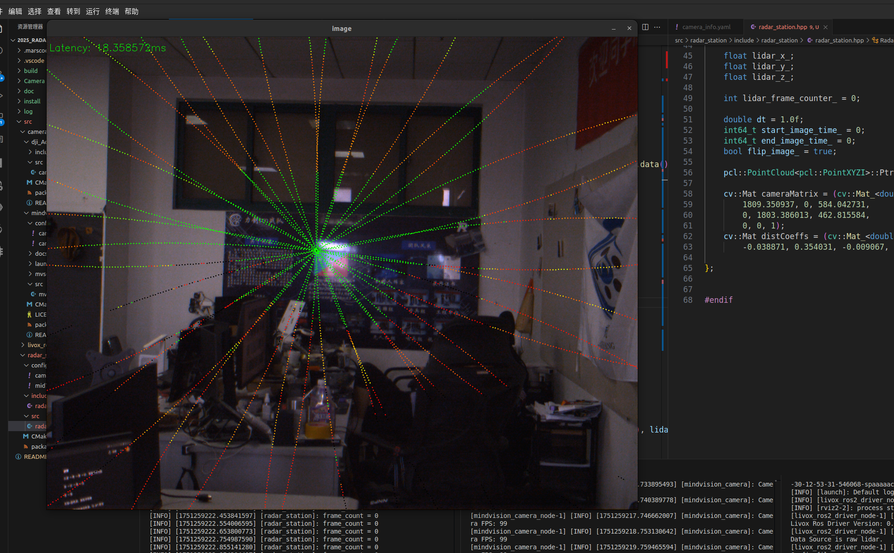

# lc_2025_radar_station

lc2025雷达站mid70激光雷达方案

### 项目编译

```bash
cd 2025_radar_station
colcon build
```

### mid70激光雷达网络配置

修改<u>2025_radar_station/src/livox_ros2_driver/livox_ros2_driver/config/livox_lidar_config.json</u>文件中的广播码

**mid70 IP地址 ：192.168.1.112**

**SN：3GGDJ8H0010012**

**广播码：3GGDJ8H00100121**

```bash
#配置网卡ip，让网卡ip与雷达在同一网段下
sudo ip addr flush dev enx6c1ff71615c0
sudo ip addr add 192.168.1.50/24 dev enx6c1ff71615c0
sudo ip link set enx6c1ff71615c0 up
```

配置电脑ip网段与min70在同一网端下192.168.1.xxx

**激光雷达启动**

```bash
source install/setup.bash 
ros2 launch livox_ros2_driver livox_lidar_rviz_launch.py #启动带rviz2可视化
ros2 launch livox_ros2_driver livox_lidar_launch.py #不带rviz2可视化
```

### mindvision相机启动与标定

```bash
ros2 launch mindvision_camera mv_launch.py
ros2 run camera_calibration cameracalibrator --size 8x11 --square 0.02000 image:=/image_raw
```


## 开发日志

## 6.29

完成雷达站驱动的构建，包括相机驱动，雷达驱动

创建了雷达站主程序包

- [x] 完成订阅雷达点云图并进行雷达点云转换到相机坐标系下的逻辑部分，具体变换矩阵还需要进行标定
- [x] 完成订阅相机话题数据，并且将雷达点云进行投影

具体效果图


对于数据同步部分，由于相机帧率非常高，所以采用抽帧法来实现软同步，当雷达点云帧累积2帧时，抽取一帧相机帧（抽取帧数可调）

## 6.30

整理了一下昨天写的代码

重新写了一下投影逻辑部分（昨天写的有点乱，逻辑不变，将定义分到头文件去）

**重写整理部分：**

```c++
for(size_t i = 0; i < point_cloud_->points.size(); i++){
            const auto& p = point_cloud_->points[i];
            intensity_values.push_back(p.intensity);
            //livox雷达坐标系与opencv坐标系定义不同，转换livox坐标系为opencv坐标系
            Eigen::Vector3f lidar_point(-p.y, -p.z, p.x);
            Eigen::Vector3f lidar_point_in_camera = R * lidar_point + T;
            cv::Point3f point_lidar_in_camera(lidar_point_in_camera.x(), lidar_point_in_camera.y(), lidar_point_in_camera.z());
            lidar_points.push_back(point_lidar_in_camera * 100);
        }
        cv::projectPoints(lidar_points, cv::Mat::zeros(3, 1, CV_64F), cv::Mat::zeros(3, 1, CV_64F), cameraMatrix, distCoeffs, lidar_points_projection);
        for(size_t i = 0; i < lidar_points_projection.size(); i++){
            cv::Scalar color;
            int index = static_cast<int>(255.0 * intensity_values[i] / 255);
            if(index > 0 && index < 255){
                color = colormap_[index];
            }else{
                color = cv::Scalar(0, 0, 0);
            }
            cv::circle(frame_, lidar_points_projection[i], 1, color, -1);
        }
```

新增了雷达点云反射率的色彩映射表，根据雷达点云反射率上色

**融合效果**



将debug图像由opencv的imshow转为用ros2的话题发布

买了块巨大的标定板（花我95    o.O）


用来标定雷达和相机之间的外参，标定用matlab的雷达外参标定算法

修改了一下代码，添加了保存点云和图像的代码，导出图像和对应的点云，用来标定(修改参数save_cloud_and_image_为1即可保存点云数据)

**添加保存部分代码**

```c++
if(save_cloud_and_image_ == 1){
    std::string cloud_filename = file_path + "/" + std::to_string(save_count) + ".pcd";
	std::string image_filename = file_path + "/" + std::to_string(save_count) + ".jpg";
    //用pcl库保存点云为.pcd格式
    pcl::io::savePCDFileBinary(cloud_filename, *point_cloud_);
    cv::imwrite(image_filename, frame_);
    save_count++;
}
```

尝试通过matlab标定相机和雷达的外参，但是在代码里面还有点问题

```c++
R << -0.0173, 0.0053, 0.9998,
     -0.0098, -0.0044, -0.0173,
     0.0043, -1.0000, 0.0054;
Eigen::Vector3f T(0.1098, 0.0189, -0.5067);

```

设点云点坐标为P1，旋转矩阵R，平移矩阵T，变换后点P2

代码中的逻辑为 P2 = R * P1 + T

```c++
Eigen::Vector3f lidar_point_in_camera = R_lidar_to_camera * lidar_point + T_lidar_to_camera;
```

**逻辑上应该没有问题但是旋转矩阵左乘后出现大量的点跑到相机坐标系后面了（点的Z值都是负数），投影到图像上的点为零？？？？？**

## 7.1

重新采集了一次点云和图像进行标定


最后重新算出来的旋转和平移矩阵

```c++
R = 	-0.0318712393232544   -0.999474459707108     0.00591848774478551
 		0.0111232139656527   -0.00627581384510766  -0.999918440809877
 		0.999430086706956    -0.0318028073252486    0.0113173862335329
    
T = 	[0.0428245893583569, 0.0104154355328730, -0.638969767020652]
```

但是结果还是错的，把矩阵转置后结果也是错的

怀疑是坐标轴的定义问题

livox-mid70激光雷达的坐标系和opencv的坐标轴的定义不一样

```c++
Eigen::Vector3f lidar_point(-p.y, -p.z, p.x);
```

根据定义将转换坐标轴后点云可以投影出来（前提是不进行雷达到相机坐标系转换P2 = R * P1 + T），但是加上坐标系转换，点云就跑飞了

看了下matlab标定出来的旋转矩阵

```c++
R = 	-0.0318712393232544   -0.999474459707108     0.00591848774478551
 		0.0111232139656527   -0.00627581384510766  -0.999918440809877
 		0.999430086706956    -0.0318028073252486    0.0113173862335329
```

四舍五入一下
```c++
R = 	0	-1	0
 		0	0	-1
 		1	0	0
```

发现matlab的标定已经将坐标轴的变换标出来了**~~（难崩）~~**

```c++
Eigen::Vector3f lidar_point(p.x, p.y, p.z);
```

把我之前写的手动变换去掉，加上旋转矩阵，点云基本能对上，但是还是有一点偏差，但是在matlab里面可视化出来基本上对齐的非常准（由于相机的内参是用matlab标定的，但代码里面的使用ros里的包标定的）

导出matlab标定的相机内参

```c++
K = 1635.80929422889	0					709.797419508020
    0					1636.89792281429	533.441903861457
    0					0					1
```

对比了一下用ros标定的相机内参，和ros标定出来的相差非常大（觉得以后要是有时间可以用matlab标定，没准自瞄还能再打准点）

**修改了内参后，点云基本全部都对齐了!!!!!!!!!!!!!!!!!!!!!!!!!!**

~~**（总算对齐了，cao）**~~


## 7.2

点云对齐部分完成，接下来完成机器人装甲板识别的逻辑

装甲板识别参考了厦门理工的双层神经网络：识别机器人整车 -> 裁切出机器人图像 -> 识别装甲板

模型用的厦门理工的开源(.onnx)

之前写过用opencv推理onnx模型的代码，稍微修改一下应该可以直接用

[之前写的推理代码]https://github.com/Spaaaace-yyj/Inference-of-the-ONNX-model-of-YOLOv8..git

然后是想办法把机器人的点云分割出来

第一次的尝试用直接用神经网络推理出来的ROI，筛选点云投影到图像中，落在ROI的点，然后找到对应的点云


但是这样很多前景和背景的点云都筛选进去了，导致误差会随着背景的情况变化，而且不准确

第二次尝试的思路是先找到在图像平面中距离神经网络推理得到的图片中心最近的投影点，然后找到这个点对应的3D位置，以这个点做球形区域，取落在球形区域内的点求平均作为机器人位置（感觉后面可以优化一下，是否可以不遍历所有点云，缩小范围，减小时间开销）


就投影点效果来看比第一次好，由于真实坐标值不好测量，所以通过求距离来评估误差，以下是通过求平均点云位置到相机的距离（单位：米）


然后是现实中用激光测距测出来的距离


经过反复测试，误差在50cm之左右，而且误差基本不变，激光雷达手册里面的随机误差在1-3cm之间波动，误差有可能来自点云对齐的误差和分割过程中还是混进去了无关点，明天尝试多采集数据来标定，看看是不是坐标系转换所带来的误差（手动给补偿值可以把误差补偿掉，而且很稳定，感觉最大可能是外参的误差）（标定板是KT板材质，会形变，之前很多数据在matlab里面大部分都舍弃了）

## 7.3

发现一个BUG，当装甲板被遮挡的时候出现double free的内存错误，用gdb调式在崩溃位置输出：

```bash
msg=std::shared_ptr<sensor_msgs::msg::Image_<std::allocator<void> >> (use count 4, weak count 0) = {...}) at /home/spaaaaace/Code/mid70/2025_radar_station/src/radar_station/src/radar_station.cpp:138
#15 0x00005555555ea5bf in std::__invoke_impl<void, void (RadarStation::*&)(std::shared_ptr<sensor_msgs::msg::Image_<std::allocator<void> > >), RadarStation*&, std::shared_ptr<sensor_msgs::msg::Image_<std::allocator<void> > > >(std::__invoke_memfun_deref, void (RadarStation::*&)(std::shared_ptr<sensor_msgs::msg::Image_<std::allocator<void> > >), RadarStation*&, std::shared_ptr<sensor_msgs::msg::Image_<std::allocator<void> > >&&)

```

其中定位到138行的操作

```bash
/home/spaaaaace/Code/mid70/2025_radar_station/src/radar_station/src/radar_station.cpp:138
```

```c++
target_[j].robot_points_roi_.push_back(lidar_points[i]);
```

问了下AI：[自己创建了裸指针的 vector，并重复用了它的 buffer]

重新走了一遍机器人类Robot实例化的过程

```c++
if(!onnx_boxes_armor.empty()){
                onnx_boxes_car[i].class_id = onnx_boxes_armor[0].class_id;
                robot_temp.id_ = onnx_boxes_car[i].class_id;
                target_temp.push_back(robot_temp);
            }else{
                onnx_boxes_car[i].class_id = -1;
            }
```

只有当检测到机器人并且检测到装甲板的时候，将装甲板的ID给到Robot并且pushback到全局"std::vector<Robot> target_",但是如果只检测到机器人，没有检测到装甲板，target的vector里就是空的，然后由于检测到了机器人，在上面点云聚类的时候就会进到这个for循环里面

```c++
for(size_t j = 0; j < min_dis_point_id.size(); j++){
	float dis_3D = std::sqrt(std::pow(lidar_points[i].x - 		lidar_points[min_dis_point_id[j]].x, 2) + std::pow(lidar_points[i].y - lidar_points[min_dis_point_id[j]].y, 2) + std::pow(lidar_points[i].z - lidar_points[min_dis_point_id[j]].z, 2));
                if(dis_3D < range_of_roi_){
                    target_[j].robot_points_roi_.push_back(lidar_points[i]);
                    target_[j].get_real_pos();
                    float dis = std::sqrt(std::pow(target_[j].real_pos_.x, 2) + std::pow(target_[j].real_pos_.y, 2) + std::pow(target_[j].real_pos_.z, 2));
                    std::cout << "dis = " << dis << std::endl;
                    colored_point.r = 255;
                    colored_point.g = 0;
                    colored_point.b = 0;
                }else{
                    colored_point.r = 0;
                    colored_point.g = 255;
                    colored_point.b = 0;
                }
            }    
```

里面有对target_[j]的操作，但是他是空的，所以程序爆了

所以补上当没有检测到装甲板的时候的逻辑就行：

```c++
            //修复如果没有装甲板识别到的情况
            if(!onnx_boxes_armor.empty()){
                onnx_boxes_car[i].class_id = onnx_boxes_armor[0].class_id;
                robot_temp.id_ = onnx_boxes_car[i].class_id;
                target_temp.push_back(robot_temp);
            }else{
                onnx_boxes_car[i].class_id = -1;
                robot_temp.id_ = -1;
                target_temp.push_back(robot_temp);
            }
```

测试后这个问题解决

发现点云数据会堆积在ros的消息队列里面，当资源空闲的时候会突然爆发式的接受，一次可以接受10帧点云，目前找到原因，但是还没有解决思路（感觉是在进入相机帧处理的时候耗时太久了）

雷达站程序运行的延迟在250ms左右，对程序分块测试发现点云聚类时间为1ms左右坐标系转换在10ms左右，而推理耗时将近200ms，基本上所有时间都在双层神经网络推理上

尝试用OpenVINO推理，尝试失败（不会用啊啊啊啊啊  q_q）

```bash
ovc car.onnx
```

今天主要整理优化了一下前面写的代码，解决了一些之前埋下的坑（BUG），然后学习了OpenVINO的c++API，成功推理，但是对推理结果还无法正常解析。

###### git

```bash
echo "# 2025_radar_station" >> README.md
git init
git add README.md
git commit -m "first commit"
git branch -M main
git remote add origin git@github.com:Spaaaace-yyj/2025_radar_station.git
git push -u origin main
```